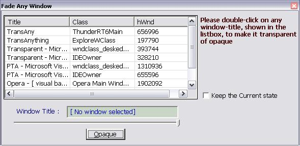



## Transparent Any Window

### Description

<B>

NOW THE BUG IS FIXED

</B>

This simple program can sets the opacity and transparency of any open window/form. No custom ocx or custom dll is used here. If you want to use it in WIN9X, make a setup.exe using the simple tool: 'Package & Deployment Wizard' that Visual Studio provided and run the setup.

Dont forget to vote and if you want to upload the code just leave a comment for me.

By the way, thank you 'Sherwood, Donald' for your feedback which help me to fix the bug.
 
### More Info
 
no input required

it returns nothing

no side effect

             |
---                |---
**Submitted On**   |2002-11-26 10:17:46
**By**             |[Blue Eyes](https://github.com/Planet-Source-Code/PSCIndex/blob/master/ByAuthor/blue-eyes.md)
**Level**          |Intermediate
**User Rating**    |5.0 (10 globes from 2 users)
**Compatibility**  |VB 4\.0 \(32\-bit\), VB 5\.0, VB 6\.0
**Category**       |[Coding Standards](https://github.com/Planet-Source-Code/PSCIndex/blob/master/ByCategory/coding-standards__1-43.md)
**World**          |[Visual Basic](https://github.com/Planet-Source-Code/PSCIndex/blob/master/ByWorld/visual-basic.md)
**Archive File**   |[Transparen1580324282003\.zip](https://github.com/Planet-Source-Code/blue-eyes-transparent-any-window__1-41053/archive/master.zip)

